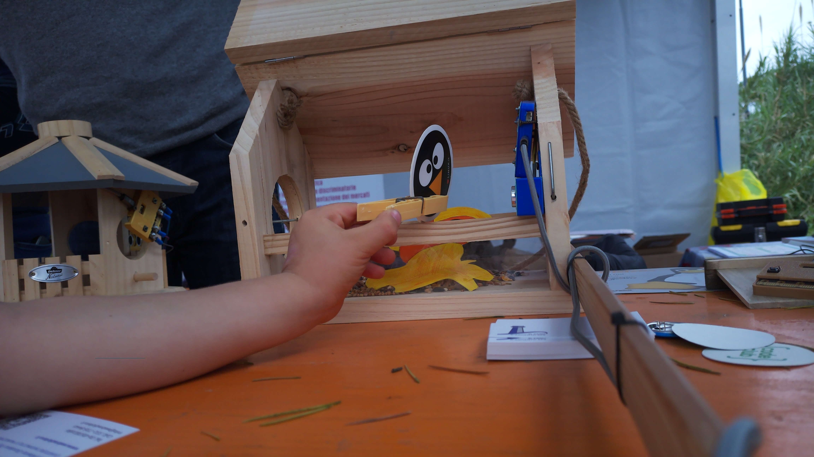
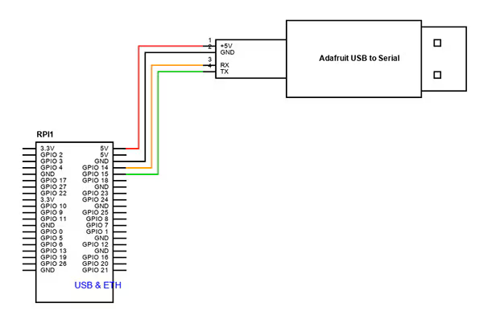
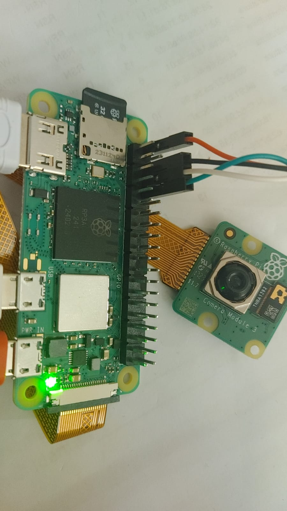

# Birdgarden 2.0


Progetto realizzato a cura dei soci di il faro d'argento APS [www.webradiofaro.it](www.webradiofaro.it)

Il progetto Birdgarden 2.0 mira alla realizzazione di una casetta/nido o mangiatoia per gli uccellini, monitorata attraverso una camera ed un microfono nascosti che metterà a disposizione su internet i dati rilevati, l’audio e le foto scattate nei momenti in cui viene occupata.




Per l'inizializzazione del dispositivo al primo utilizzo sono necessarie alcune attività per le quali è necessario collegare al dispositivo un monitor o TV tramite il cavo HDMI ed una tastiera+mouse tramite il cavo USB aggiuntivo.

 In alternativa è possibile configurare il sistema raspberry attraverso una connessione seriale, per mezzo di un cavo del tipo USB-to-SERIAL con chip PL2303, facendo attenzione al fatto che sia utilizzabile con la tensione dei 3V dei GPIO del Raspberry.

 

Per il collegamento attraverso la porta seriale è necessario abilitarne l'accesso nel file /boot/firmware/config.txt inserendo la seguente riga: enable_uart=1

Nelle versioni più recenti del sistema Raspian OS non esiste un utente preconfigurato con cui eseguire il login tuttavia tramie il software Raspberry Pi Imager è possibile definire le principali configurazioni prima ancora del primo avvio, cosa che in questo progetto abbiamo fatto per voi.

Per i sistemi Linux Debian è sufficiente digitare il comando
~~~
sudo apt install rpi-imager
~~~ 

Mentre per Windows si può scaricare l'installer direttamente dal sito [raspberrypi.com](https://www.raspberrypi.com/software/)]


Per il collegamento via seriale abbiamo utilizzato il comando: tio /dev/ttyUSB0, dopo aver verificato che il device ttyUSB0 fosse correttamente associato al cavo USB-to-serial inserito, per mezzo del comando: sudo dmesg, che fornisce le seguenti informazioni:

~~~bash
[ 7849.113480] usb 1-2: new full-speed USB device number 13 using xhci_hcd
[ 7849.240467] usb 1-2: New USB device found, idVendor=067b, idProduct=2303, bcdDevice= 4.00
[ 7849.240514] usb 1-2: New USB device strings: Mfr=1, Product=2, SerialNumber=0
[ 7849.240537] usb 1-2: Product: USB-Serial Controller
[ 7849.240555] usb 1-2: Manufacturer: Prolific Technology Inc.
[ 7849.245418] pl2303 1-2:1.0: pl2303 converter detected
[ 7849.248483] usb 1-2: pl2303 converter now attached to **ttyUSB0**
~~~




## Configurazione iniziale

Tenete a mente che durante il primo avvio il sistema opera delle configurazioni automatiche ed esegue anche un riavvio automatico, quindi impiega necessariamente più tempo a partire rispetto ad una normale procedura, come accadrà in seguito. Se tutto è andato a buon fine avrete a video la richiesta di login, oppure il desktop del sistema Raspian OS, se avete installato la versione desktop. In tal caso potrete aprire una finestra terminale per proseguire con le attività di configurazione descritte nel seguito.

Eseguire le operazioni seguenti:

- eseguire il login con username e password impostati (l'importante è che la home directory si chiami /home/ilfarodargento)
- eseguire l’aggiornamento di RPI Os con i comandi:

```bash
$ sudo -s 
$ export DEBIAN_FRONTEND=noninteractive
$ apt update -y \
  && apt upgrade -y \
  && apt full-upgrade -y
```
> [!NOTE] 
> Questo task può durare anche 30 minuti

Occorre fornire al sistema un nuovo dispositivo audio differente da quello dell'uscita HDMI. l'indicazione che vogliamo un ulteriore dispositivo di uscita per l'audio e che quindi debba essere redirezionato sui pin GPIO 18 e 13 in modalità PWM

~~~bash
gpio=18,13,a5
audio_pwm_mode=2
dtoverlay=audremap,pins_18_13
~~~

Terminato l'operazione è consigliato effettuare il riavvio

Procedere all'installazione delle dipendenze

~~~bash
$ sudo apt update && \
  sudo apt install -y python3-picamera2\
                      ffmpeg \
                      git \
                      python3-serial \
~~~

Terminata l'installazione effettuare il clone di questo repository all'interno della RPi

~~~bash
$ git clone https://github.com/idamato/birdgarden/
~~~

e procedere all'installazione

~~~
$ cd birdgarden
$ sudo bash install_rpi.sh
~~~


- modificare username e password e identificativo TAG con la CPUID nel file wordpress_playground.py secondo le indicazioni ricevute al momento dell'adesione al progetto. (Viene creato un account all'interno del portale Birdgarden 2.0 con le credenziali per la pubblicazione delle foto/video dal dispositivo)
- eseguire il test del focus della fotocamera sulla vostra installazione. Dovete prima disattivare il servizio con il comando: `sudo systemctl stop photo.service` (potrete poi riavviarlo con il comando di start) e di seguito date il comando: `python3 test-camera-focus.py`; tenete presente che se state utilizzando il terminale senza grafica dovrete prima modificare lo script impostando la preview a False. Tenete a mente che ogni modello di camera ha le sue caratteristiche.
- collegare anche il dispositivo micro:bit caricandovi il codice `serial_data_logger.py` tramite il sito [Makecode](makecode.microbit.org).
- Se si desidera modificare la configurazione del WiFi si può procedere nel modo seguente: eseguire il comando: `sudo nmtui`, ed abilitare la rete wifi di interesse.

Ci sono inoltre una serie di aspetti di configurazione che sono stati curati all'interno del portale https://www.webradiofaro.it/birdgarden/ che utilizza Wordpress. In particolare deve essere creato un utente/ruolo specifico associato al dispositivo in modo che nello stesso portale possano concorrere le pubblicazioni di tutti i dispositivi. Oltre all'utente deve essere anche creata una chiave applicativa legata all'applicazione Birdgarden e con essa si avranno le credenziali da inserire nello scirpt Python per l'invio dati. Uno specifico tag verrà associato alla CPUID del dispositivo Raspberry Pi Zero 2W e le coordinate geografiche dovranno essere fornite affinché sia attivato il puntamento all'interno della mappa.
